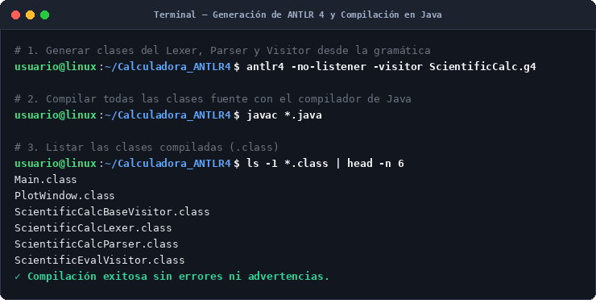
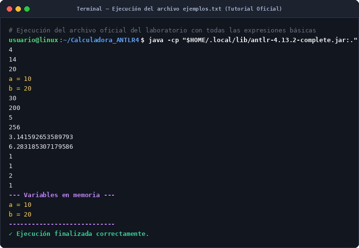
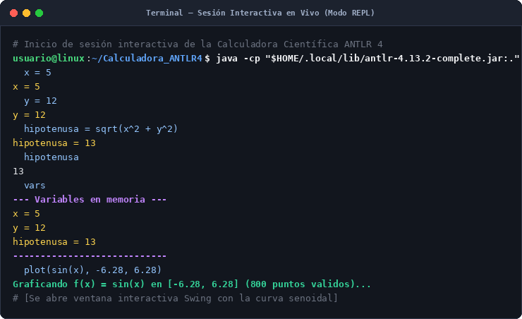
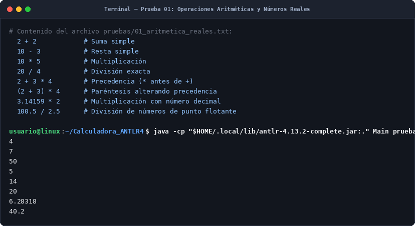
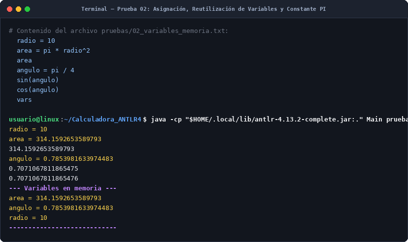
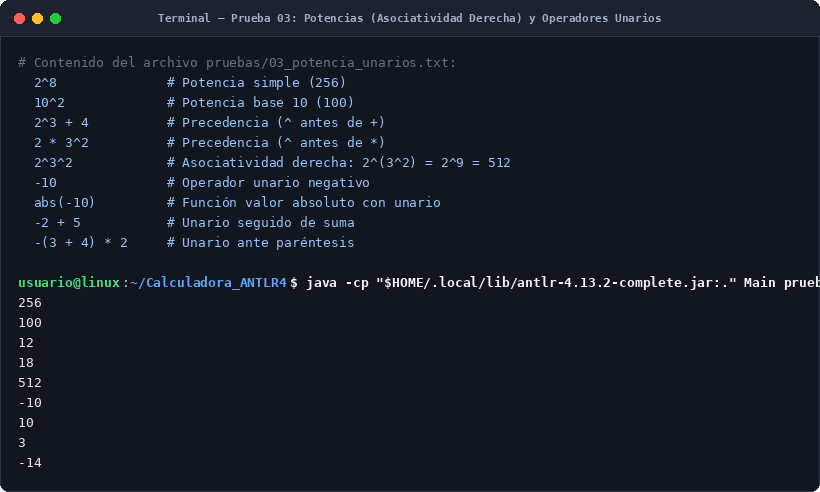
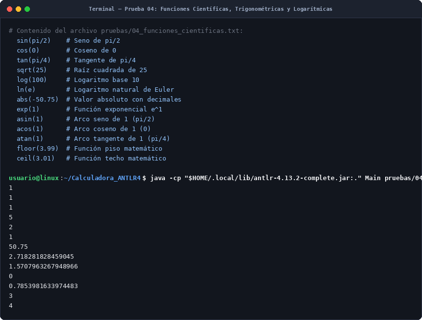
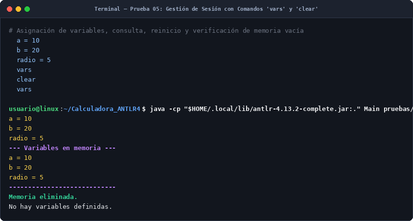
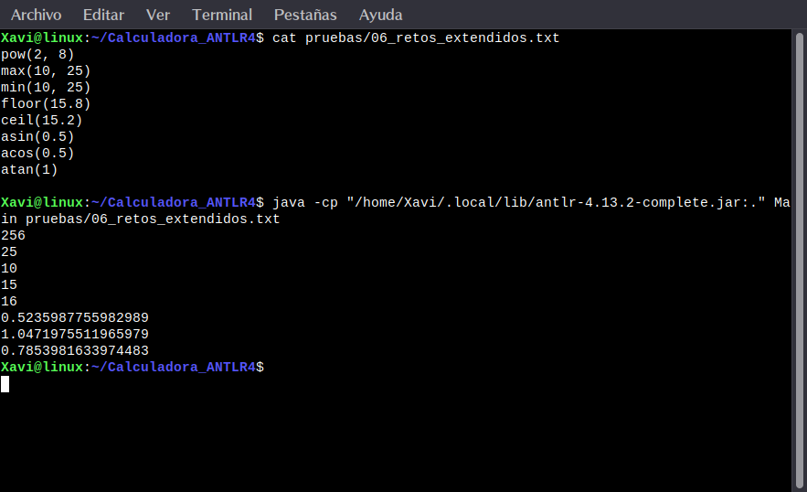

# Calculadora Científica y Graficadora con ANTLR 4 y Patrón Visitor

Los integrantes: Dylan Torres - Juan Gomez - Javier Rosero

---

## 1. Introducción y Propósito

Este trabajo implementa una **Calculadora Científica y Graficadora interactiva** basada en el tutorial de laboratorio.

A través del generador de analizadores ANTLR 4 y el patrón de diseño **Visitor** en Java, el sistema evoluciona desde una calculadora aritmética básica hasta un Lenguaje de Dominio Específico (DSL) matemático completo con soporte para:
- Números reales (enteros y decimales de doble precisión `Double`).
- Expresiones aritméticas con precedencia jerárquica estricta y asociatividad a derecha para potencias (`^`).
- Operadores unarios (`+` y `-`).
- Constantes matemáticas integradas (`pi`, `e`).
- Funciones científicas de uno y dos argumentos (`sin`, `cos`, `tan`, `asin`, `acos`, `atan`, `sqrt`, `log`, `ln`, `abs`, `exp`, `floor`, `ceil`, `pow`, `max`, `min`).
- Tabla de símbolos dinámica para asignación y persistencia de variables en memoria (`Map<String, Double>`).
- Comandos de gestión de sesión (`clear` y `vars`).
- Motor de muestreo y visualización gráfica interactiva con Java Swing (`plot(expr, xmin, xmax)` y `plot(expr, xmin, xmax, ymin, ymax)`).

---

## 2. Estructura del Proyecto

El repositorio organiza el código fuente, la automatización con Makefile y los conjuntos de pruebas:

```text
Calculadora_ANTLR4/
├── ScientificCalc.g4           # Gramática de la calculadora científica y graficadora
├── ScientificEvalVisitor.java  # Implementación del Visitor (evaluador numérico, memoria y muestreo)
├── PlotWindow.java             # Interfaz gráfica en Java Swing para el trazado de funciones
├── Main.java                   # Punto de entrada de la aplicación
├── Makefile                    # Automatización de generación, compilación, pruebas y limpieza
├── ejemplos.txt                # Archivo de pruebas oficial del tutorial
├── Tutorial_ANTLR.pdf          # Guía del laboratorio
├── .gitignore                  # Exclusión de binarios compilados y archivos autogenerados
├── README.md                   # Documentación técnica, respuestas a preguntas, retos y evidencias
└── pruebas/                    # Suite de pruebas organizada por componentes
    ├── 01_aritmetica_reales.txt
    ├── 02_variables_memoria.txt
    ├── 03_potencia_unarios.txt
    ├── 04_funciones_cientificas.txt
    ├── 05_comandos_clear_vars.txt
    └── 06_retos_extendidos.txt
```

---

## 3. Compilación y Ejecución con Makefile

Todo el ciclo de vida del proyecto (generación de código ANTLR 4, compilación de clases Java, ejecución interactiva, pruebas y limpieza) se encuentra completamente automatizado mediante el archivo `Makefile`.

Sitúate en la raíz del repositorio en la terminal:

```bash
cd "/home/Xavi/Escritorio/Trabajos/Materias/Lenguajes de Programacion y Transduccion/Calculadora_ANTLR4"
```

### Comandos disponibles en el Makefile

| Comando | Descripción de la acción |
| :--- | :--- |
| `make` o `make compile` | Genera las clases del Lexer, Parser y Visitor con `antlr4` y compila todos los `.java`. |
| `make test` | Compila y ejecuta el archivo de prueba oficial `ejemplos.txt`. |
| `make run` | Inicia la calculadora en **modo interactivo (REPL)** por terminal. |
| `make test-all` | Ejecuta de forma secuencial todas las suites de prueba en `pruebas/`. |
| `make clean` | Elimina todos los archivos binarios (`.class`) y clases autogeneradas por ANTLR. |
| `make help` | Muestra el menú de ayuda con los comandos disponibles. |

---

### Evidencias de Ejecución

#### 1. Compilación del proyecto (`make compile`)
```bash
make compile
```


#### 2. Ejecución del archivo de pruebas oficial (`make test`)
```bash
make test
```


#### 3. Modo interactivo en vivo (`make run`)
```bash
make run
```



---

## 4. Respuestas a los Recuadros de Análisis del Tutorial (Azules y Verdes)

### Detente y analiza (Página 6)
**Pregunta:** ¿Por qué cree que resulta conveniente tener un método diferente para una suma, una multiplicación y un número?  
**Respuesta:** Porque cada nodo del árbol sintáctico representa una operación semántica con reglas y comportamientos totalmente distintos. Al separar los métodos (`visitAddSub`, `visitMulDiv`, `visitNumber`), el código en Java resulta modular, limpio y fácil de mantener, evitando estructuras condicionales gigantes (`if/else` o `switch`) dentro de un único método para adivinar qué tipo de nodo se está evaluando.

---

### Ahora hazlo tú (Página 8)
**Pregunta:** Determine si los siguientes textos pueden ser reconocidos por la regla `ID : [a-zA-Z_][a-zA-Z_0-9]* ;`:
- `variable`
- `x2`
- `2x`
- `_resultado`
- `variable-final`

**Análisis:**
- `variable`: **Válido.** Inicia con una letra y continúa con caracteres alfabéticos.
- `x2`: **Válido.** Inicia con la letra `x` y le sigue el dígito `2`.
- `2x`: **No reconocido como un único ID.** La regla exige que el primer carácter sea una letra o guion bajo (`[a-zA-Z_]`). El Lexer lo dividirá en dos tokens independientes: el número `2` (`NUMBER`) y la variable `x` (`ID`).
- `_resultado`: **Válido.** Inicia con guion bajo, lo cual está explícitamente permitido por el patrón.
- `variable-final`: **No reconocido como un único ID.** El carácter `-` no pertenece al conjunto `[a-zA-Z_0-9]`. El Lexer lo tokenizará como tres elementos separados: `variable` (`ID`), `-` (`SUB`) y `final` (`ID`).

---

### Detente y analiza (Página 9)
**Pregunta:** Compare los métodos generados en `ScientificCalcVisitor.java` con las etiquetas utilizadas en la gramática. ¿Qué relación encuentra?  
**Respuesta:** La relación es directa de uno a uno. Cada etiqueta colocada al final de una alternativa en la gramática (por ejemplo `# power`, `# assign`, `# functionCall`) se convierte exactamente en un método de visita en la interfaz generada por ANTLR (`visitPower`, `visitAssign`, `visitFunctionCall`). Las etiquetas determinan los nombres de las clases de contexto y de los métodos del Visitor.

---

### Detente y analiza (Página 16)
**Pregunta:** ¿Qué sucedería si escribiera `resultado + 10` sin haber asignado previamente un valor a `resultado`? ¿Considera adecuado devolver cero o sería mejor producir un error?  
**Respuesta:** Si la variable no existe en `memory`, el método `visitId` no la encontrará. Devolver `0.0` permite que la ejecución continúe sin colapsar el programa, pero oculta un fallo de lógica del usuario. En un lenguaje de producción es mucho más adecuado emitir un **error semántico explícito** (o advertencia en `System.err`) para avisar al usuario que la variable no está inicializada antes de adoptar un valor por defecto.

---

### Ahora hazlo tú (Página 27)
**Pregunta:** Modifique el código de muestreo para que solamente almacene valores válidos con `if(Double.isFinite(y))`. ¿Qué efecto tiene esta modificación sobre la gráfica de `1/x`?  
**Respuesta:** En \(x = 0\), la función \(1/x\) produce una asíntota vertical (\(\pm \infty\)). Si se intentaran graficar valores infinitos o `NaN`, el sistema de dibujo generaría excepciones o trazaría líneas verticales artificiales cruzando toda la pantalla. Al filtrar con `Double.isFinite(y)`, los puntos en la discontinuidad se descartan de la lista de coordenadas, permitiendo que la curva se dibuje correctamente en dos ramas asintóticas independientes sin artefactos visuales.

---

### Detente y analiza (Página 33)
**Pregunta:** Cuando se ejecuta el Visitor `visit(ctx.expr())`, ¿se evalúa una cadena de texto o se visita una estructura de árbol?  
**Respuesta:** Se visita una **estructura de árbol en memoria (Parse Tree)**. `ctx.expr()` no es un `String`, sino un objeto Java (`ParseTree` / `RuleContext`) con referencias a nodos hijos y terminales. El Visitor recorre estos objetos en memoria ejecutando las llamadas en cascada de abajo hacia arriba.

---

## 5. Respuestas a las Preguntas Finales (Sección 41)

### 1. ¿Cuál es la responsabilidad del Lexer?
Su responsabilidad es tomar el flujo continuo de caracteres de entrada, aplicar expresiones regulares para agruparlos en unidades léxicas con significado (tokens) y descartar elementos irrelevantes para la sintaxis (como espacios en blanco y tabulaciones).

### 2. ¿Cuál es la responsabilidad del Parser?
Tomar la secuencia de tokens entregada por el Lexer, validar que cumplan el orden y las reglas estructurales definidas por la gramática libre de contexto, y construir el árbol sintáctico (Parse Tree) en memoria.

### 3. ¿Qué función cumplen las etiquetas como `#addSub` o `#functionCall`?
Indican a ANTLR que cree subclases de contexto independientes para cada alternativa de una regla sintáctica, generando métodos de visita específicos en el Visitor (`visitAddSub`, `visitFunctionCall`) para manejar cada caso por separado.

### 4. ¿Qué ventaja ofrece el patrón Visitor?
Permite desacoplar completamente la gramática de la lógica de evaluación. La gramática permanece limpia y reutilizable, mientras que toda la lógica de cálculo, control de memoria y reporte de errores se implementa en Java con control total del flujo de recorrido y retorno de tipos genéricos (`Double`).

### 5. ¿Qué representa la tabla de símbolos?
Representa la memoria del intérprete (`Map<String, Double> memory`). Es una estructura de datos que almacena el mapeo entre los identificadores (nombres de variables) y sus valores calculados asociados durante la sesión.

### 6. ¿Por qué la variable `x` cambia continuamente durante una gráfica?
Porque para representar una curva continua \(y = f(x)\), el comando `plot` divide el intervalo horizontal \([x_{min}, x_{max}]\) en 800 muestras discretas. En cada iteración se asigna un nuevo valor a la variable `"x"` en la tabla de símbolos para evaluar el punto correspondiente.

### 7. ¿Por qué podemos evaluar el mismo árbol sintáctico varias veces?
Porque el árbol sintáctico construido por ANTLR es una estructura inmutable en memoria. Al invocar `visit(tree)` múltiples veces con diferentes valores en la tabla de símbolos (como el valor de `x`), el Visitor recalcula la expresión sin necesidad de volver a procesar el texto ni reconstruir el árbol.

### 8. ¿Qué sucede cuando se intenta graficar una función con una discontinuidad?
En puntos de discontinuidad o asíntotas (como \(1/x\) en \(0\) o \(\tan(x)\) en \(\pi/2\)), la evaluación produce valores infinitos (`Double.isInfinite`) o indeterminaciones (`Double.isNaN`). Al validar con `Double.isFinite(y)` y controlar los saltos de signo abruptos, el sistema descarta los puntos inválidos y evita dibujar líneas continuas que crucen incorrectamente la pantalla.

### 9. ¿Qué modificaciones serían necesarias para implementar funciones con dos argumentos?
Se debe extender la gramática añadiendo una regla para funciones binarias (ej. `function2 '(' expr ',' expr ')' # functionCall2`) y sobreescribir en el Visitor el método `visitFunctionCall2`, evaluando `visit(ctx.expr(0))` para el primer argumento y `visit(ctx.expr(1))` para el segundo (ej. `Math.pow(a, b)`, `Math.max(a, b)`).

### 10. ¿Por qué la calculadora desarrollada puede considerarse un lenguaje de dominio específico (DSL)?
Porque posee una sintaxis diseñada exclusivamente para resolver problemas dentro de un dominio concreto (el cálculo y análisis matemático-científico interactivo), ofreciendo primitivas directas de evaluación, persistencia de variables y graficación sin la sobrecarga de un lenguaje de propósito general.

---

## 6. Solución a los 5 Retos (Sección 42)

### Reto 1 – Nuevas funciones científicas
Se incorporaron las funciones trigonométricas inversas y de redondeo a la regla `function`:
```antlr
function
    : 'sin' | 'cos' | 'tan' | 'asin' | 'acos' | 'atan'
    | 'sqrt' | 'log' | 'ln' | 'abs' | 'exp' | 'floor' | 'ceil'
    ;
```
En `ScientificEvalVisitor.java`:
```java
case "asin":  return Math.asin(value);
case "acos":  return Math.acos(value);
case "atan":  return Math.atan(value);
case "floor": return Math.floor(value);
case "ceil":  return Math.ceil(value);
```

---

### Reto 2 – Funciones con dos argumentos
Se diseñó la regla sintáctica:
```antlr
expr
    : ...
    | function2 '(' expr ',' expr ')' # functionCall2
    ;

function2
    : 'pow' | 'max' | 'min'
    ;
```
En `ScientificEvalVisitor.java`:
```java
@Override
public Double visitFunctionCall2(ScientificCalcParser.FunctionCall2Context ctx) {
    String func = ctx.function2().getText();
    Double arg1 = visit(ctx.expr(0));
    Double arg2 = visit(ctx.expr(1));
    if (arg1 == null || arg2 == null) return null;

    switch (func) {
        case "pow": return Math.pow(arg1, arg2);
        case "max": return Math.max(arg1, arg2);
        case "min": return Math.min(arg1, arg2);
        default: return null;
    }
}
```

---

### Reto 3 – Rango vertical en el comando `plot`
Se extendió la regla `stat` para permitir especificar límites verticales opcionales:
```antlr
stat
    : ...
    | 'plot' '(' expr ',' expr ',' expr ',' expr ',' expr ')' NEWLINE # plotRangeExpr
    ;
```
Esto permite ejecutar comandos como `plot(sin(x), -3.14, 3.14, -2.0, 2.0)`, fijando los límites del eje vertical directamente en `PlotWindow`.

---

### Reto 4 – Graficar varias funciones simultáneamente
**Diseño sintáctico:**
Para permitir graficar múltiples funciones en una sola ventana (ej. `plot(sin(x), cos(x), -6.28, 6.28)`), se diseña la regla:
```antlr
plotMulti
    : 'plot' '(' exprList ',' expr ',' expr ')' NEWLINE # plotMultiExpr
    ;

exprList
    : expr (',' expr)*
    ;
```
En el Visitor se itera sobre la lista de expresiones `ctx.exprList().expr()`, generando una serie de datos `List<List<Double>> ySeries` y asignando un color diferente a cada curva en el panel gráfico.

---

### Reto 5 – Definición de funciones de usuario
**Diseño sintáctico y arquitectónico:**
Para permitir que el usuario defina funciones personalizadas como `f(x) = x^2 + 2*x + 1` y las evalúe con `f(5)` o `plot(f(x), -10, 10)`:
1. **Gramática:**
```antlr
stat
    : ID '(' ID ')' '=' expr NEWLINE # funcDef
    ;

expr
    : ID '(' expr ')' # userFuncCall
    ;
```
2. **Semántica en el Visitor:**  
Se almacena una tabla de funciones `Map<String, FunctionDefinition>`, donde cada definición guarda el nombre del parámetro formal (ej. `"x"`) y el subárbol sintáctico de la expresión (`ParseTree body`). Al invocar `f(5)`, se guarda temporalmente el argumento actual en `"x"`, se evalúa el subárbol `body` mediante `visit(body)` y se restaura el entorno previo.

---

## 7. Verificación de Pruebas Manuales (Recuadros Rojos)

Las pruebas individuales pueden ejecutarse mediante `make test-all` o pasando el archivo específico al ejecutable de Java.

### Prueba 01: Operaciones Aritméticas y Números Reales


---

### Prueba 02: Asignación y Persistencia de Variables


---

### Prueba 03: Potencias (Asociatividad a Derecha) y Operadores Unarios


---

### Prueba 04: Funciones Científicas, Trigonométricas y Logarítmicas


---

### Prueba 05: Gestión de Sesión con Comandos `vars` y `clear`


---

### Prueba 06: Funciones de Dos Argumentos y Retos de Extensión

